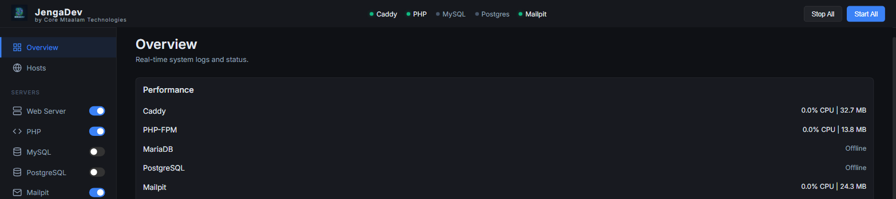

# JengaDev

**A portable, zero-config local dev server for Windows.** Caddy, PHP, MySQL/MariaDB, PostgreSQL, SQLite, and Mailpit, managed from one browser dashboard — with automatic local HTTPS out of the box.

## Why JengaDev

XAMPP is dated. Laragon is fast and free, but automatic HTTPS and mail testing still take manual setup. JengaDev gives you both for free, out of the box:

| Feature | JengaDev | Laragon | XAMPP |
|---|---|---|---|
| Local HTTPS | **Automatic (Caddy)** | Manual mkcert setup | Not built in |
| Mail catcher | **Built in (Mailpit)** | Not bundled | Not bundled |
| Databases | MySQL/MariaDB + PostgreSQL + SQLite | MySQL/MariaDB + addons | MySQL/MariaDB |
| Control surface | Browser dashboard | Native tray app | Native control panel |
| Platforms | Windows | Windows | Windows / macOS / Linux |

## Features

- **One-click local HTTPS** for every hosted site via Caddy — no manual certificate setup.
- **Multiple databases** — MySQL/MariaDB, PostgreSQL, and SQLite, each with an admin UI (phpMyAdmin/Adminer).
- **Mailpit built in** — catch and inspect outgoing mail from every hosted site without touching a real SMTP server.
- **Per-host PHP error logs** with automatic size-based rotation, so logs stay manageable as the number of sites grows.
- **Switchable PHP versions** — pick from several PHP builds per project.
- **Browser dashboard** — start/stop services, manage hosts, databases, and PHP config from `http://127.0.0.1:4000`, opened automatically (with an authenticated session) when you launch JengaDev.
- **Auto-updater** — checks GitHub Releases for new versions; you approve every update explicitly.

## Installation

1. Download the latest `JengaDev_Setup_Full_*.exe` from [Releases](https://github.com/mtaalamtech/jengadev/releases).
2. Run it (it requests admin rights once, to install services and secure its own install folder).
3. JengaDev starts and opens its dashboard automatically.

## Security

JengaDev went through a structured security review before this repository went public — authentication on every dashboard API call, checksum-verified downloads for every third-party component it fetches, and a locked-down install directory so other accounts on a shared machine can't tamper with it. Found a security issue? Please open a private security advisory on this repo rather than a public issue.

## Third-party components

JengaDev bundles or downloads Caddy, PHP, MariaDB, PostgreSQL, phpMyAdmin, Adminer, Mailpit, and Node.js, each under its own license, plus a set of permissively-licensed npm packages. See [THIRD-PARTY-NOTICES.txt](THIRD-PARTY-NOTICES.txt) for the full list.

## License

JengaDev's own source code (`daemon/` and `dashboard/`) is licensed under the [MIT License](LICENSE). Bundled third-party components keep their own licenses.

---

Built by [Core Mtaalam Technologies](https://mtaalamtech.com).
